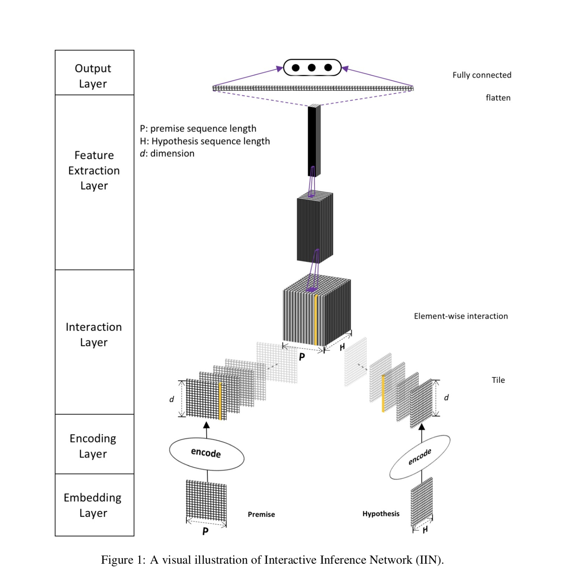

# Reproducing Densely Interactive Inference Network in Keras

This repository aims to reproduce the results obtained in
[Natural Language Inference over Interaction Space](https://arxiv.org/abs/1709.04348) paper. <br/>
We've chosen this paper as a project for 
[reproducibility challenge](http://www.cs.mcgill.ca/~jpineau/ICLR2018-ReproducibilityChallenge.html) organized by ICLR. <br/>
Our reproducibility report with more details about experiments can be found here: https://arxiv.org/abs/1802.03198 <br/>
DIIN paper in OpenReview: https://openreview.net/forum?id=r1dHXnH6-&noteId=r1dHXnH6-


### Problem statement
Given a premise sentence and a hypothesis one needs to determine whether hypothesis is
an entailment of the premise, a contradiction, or a neutral sentence. So given two sentences
we need to classify those between these 3 classes (`entailment`, `contradiction`, `neutral`).

Several samples from MultiNLI dataset are presented below which are copied from DIIN paper.

`Premise`: The FCC has created two tiers of small business for this service with the approval of the SBA. <br/>
`Hypothesis`: The SBA has given the go-ahead for the FCC to divide this service into two tiers of small business. <br/>
`Label`: entailment.

`Premise`: He was crying like his mother had just walloped him. <br/>
`Hypothesis`: He was crying like his mother hit him with a spoon. <br/>
`Label`: Neutral


`Premise`: Later, Tom testified against John so as to avoid the electric chair. <br/>
`Hypothesis`: Tom refused to turn on his friend, even though he was slated to be executed. <br/>
`Label`: Contradiction


### Architecture
`Encoding`, `Interaction`, and also exponentially `DecayingDropout` can be found in `layers/` package.
Feature extractor (in our case [DenseNet](https://arxiv.org/abs/1608.06993)) can be found in `feature_extractors/` package.
L2 optimizer wrapper can be found in `optimizers/`.



### Instructions

Our code is compatible with both `python3` and `python2` so for all commands listed below `python` can be substituted
by `python3`.

* Install requirements (`pip3` for `python3`)
```commandline
pip install -r requirements.txt
```

* Preprocess the data
```commandline
python preprocess.py --p 32 --h 32 --chars_per_word 16 --save_dir data/ --dataset snli --word_vec_save_path data/word-vectors.npy
```

* Train the model
```commandline
python train.py --batch_size 70 --eval_interval 500 --train_word_embeddings --char_embed_size 8 --char_conv_filters 100 --char_conv_kernel 5 --dropout_initial_keep_rate 1. --dropout_decay_rate 0.977 --dropout_decay_interval 10000 --first_scale_down_ratio 0.3 --transition_scale_down_ratio 0.5 --growth_rate 20 --layers_per_dense_block 8 --dense_blocks 3 --labels 3 --load_dir ./data --models_dir ./models/ --logdir ./logs --word_vec_path ./data/word-vectors.npy
```

* See the results in TensorBoard
```commandline
tensorboard --logdir=./logs
```

### Results
Currently we managed to obtain `87.34%` accuracy on `SNLI test` set, while the authors obtained `88.0%` accuracy on the same dataset.
